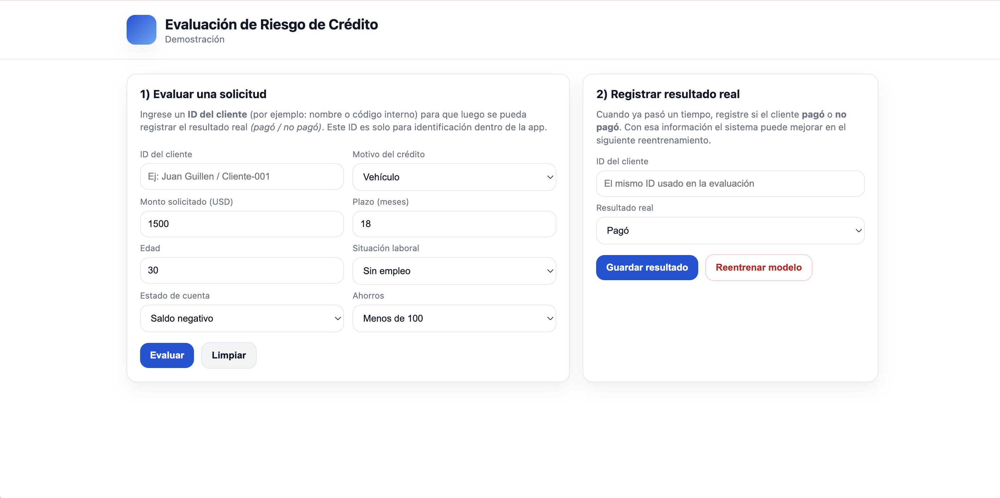
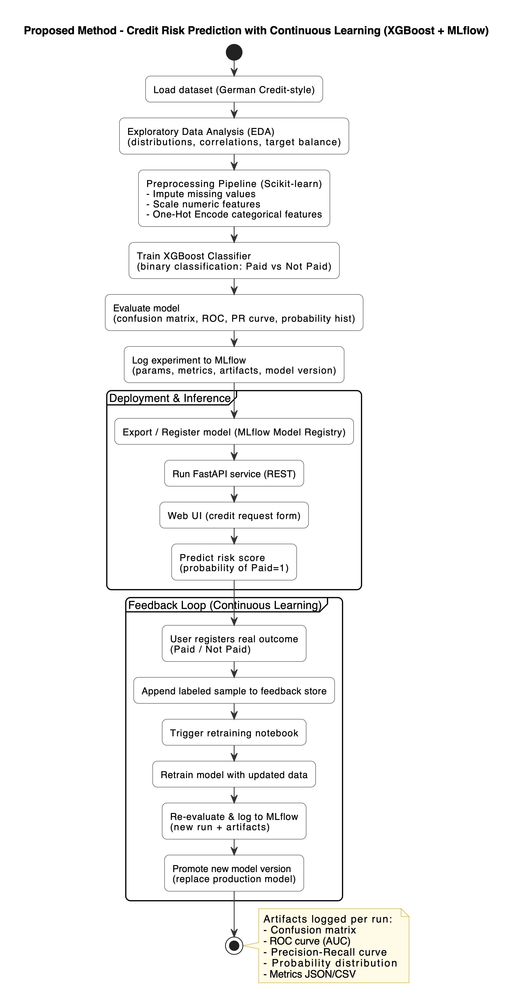
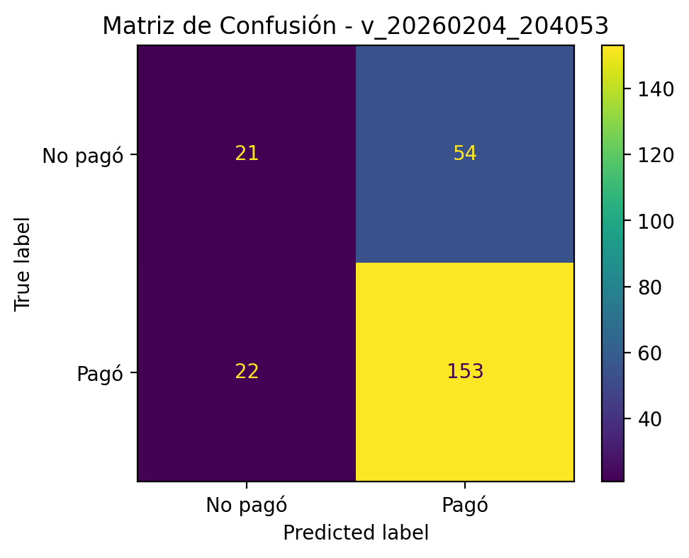
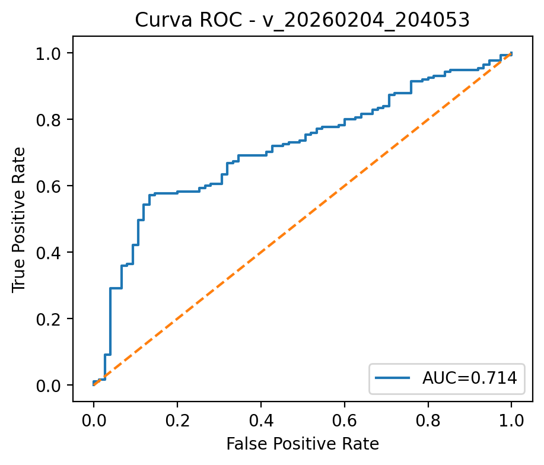
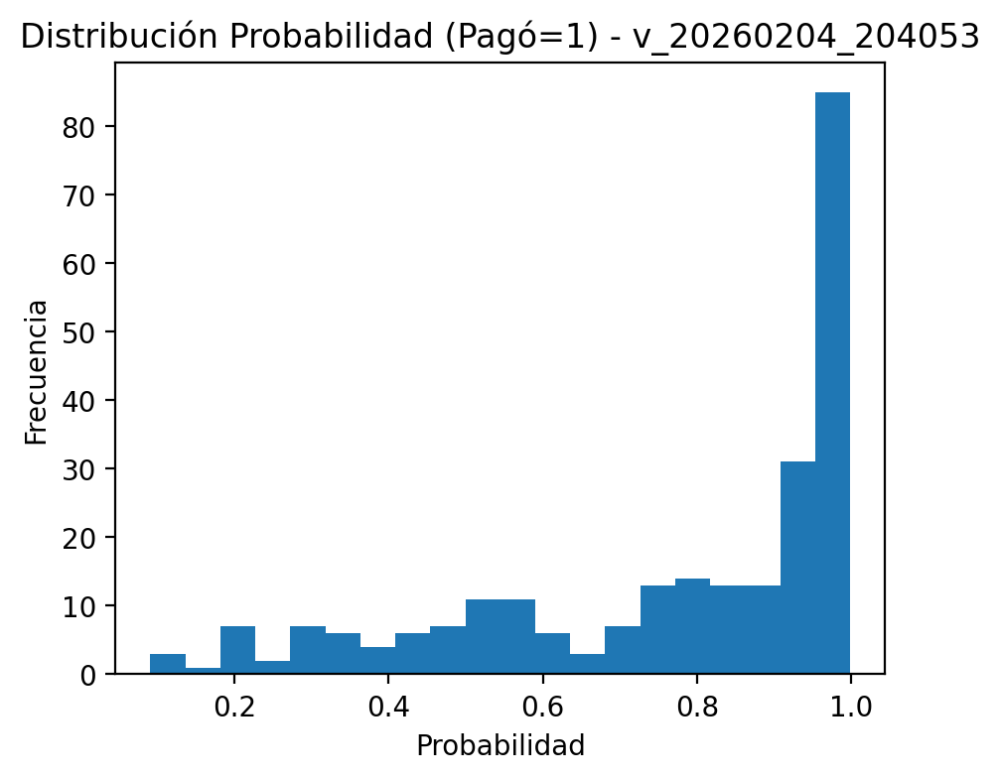

# Credit Risk Prediction System Based on XGBoost with Continuous Learning and MLflow Tracking

## Abstract

Credit risk assessment is a critical task in financial decision-making, where inaccurate evaluations may lead to financial losses and poor credit allocation. This project presents an intelligent credit risk prediction system based on supervised machine learning using XGBoost, combined with a continuous learning pipeline and full experiment tracking through MLflow. The system processes structured financial and demographic variables to estimate whether a client is likely to repay or default. The solution integrates exploratory data analysis, preprocessing pipelines, feature transformation, model training, evaluation, REST inference with FastAPI, user feedback capture, and incremental retraining. Model versions, metrics, and artifacts such as confusion matrices, ROC curves, Precision-Recall curves, and probability distributions are automatically logged and versioned. Experimental results demonstrate stable predictive performance and practical feasibility for real-time credit risk evaluation with continuous improvement through retraining.

---

# System Interface

The application provides a web interface to evaluate credit applications and later register real payment outcomes used for retraining.



---

## Technologies and Tools

**Machine Learning & Data Science**

* Python
* Pandas
* NumPy
* Scikit-learn
* XGBoost
* MLflow

**Backend**

* FastAPI
* Uvicorn

**Experiment Tracking**

* MLflow Experiments
* MLflow Model Registry
* Artifact logging

**Visualization**

* Matplotlib
* Confusion Matrix
* ROC Curve
* Precision-Recall Curve
* Probability Distribution plots

---

# 1️⃣ Proposed Method

The proposed methodology follows a structured machine learning lifecycle implemented through modular notebooks and a production-ready inference service.

Main phases:

1. Exploratory Data Analysis (EDA)
2. Data preprocessing and encoding
3. XGBoost supervised training
4. Model evaluation with multiple metrics
5. MLflow experiment tracking
6. FastAPI deployment for inference
7. Feedback capture
8. Incremental retraining
9. Model version replacement

## Proposed Method Diagram

(Generate with the PlantUML code provided and export as image)



---

# 2️⃣ Experimental Design

## Dataset Characteristics

The system uses structured German-credit style tabular data with:

* Credit duration
* Credit amount
* Age
* Checking account status
* Employment status
* Savings category
* Credit purpose

Target:

```
1 = Paid
0 = Not paid
```

Suitable for supervised binary classification.

---

## Model Parameters — XGBoost

| Parameter     | Value              |
| ------------- | ------------------ |
| Algorithm     | XGBoost Classifier |
| n_estimators  | 200                |
| learning_rate | 0.1                |
| max_depth     | 5                  |
| random_state  | 42                 |
| eval_metric   | logloss            |

---

# 3️⃣ Results and Discussion

Each retraining cycle is logged in MLflow with full artifacts and metrics.

## Latest MLflow Metrics (From Your Run)

From your metrics JSON:

| Metric    | Value      |
| --------- | ---------- |
| Accuracy  | **0.70**   |
| Precision | **0.74** |
| Recall    | **0.87**   |
| F1-score  | **0.80** |
| ROC-AUC   | **0.71** |

This indicates moderate discrimination with recall-oriented behavior — useful when missing risky clients is more costly than reviewing false positives.

---

## Confusion Matrix



Model shows stronger detection of Paid class with some false positives — threshold tuning can improve balance.

---

## Precision-Recall Curve


Demonstrates stable precision at mid-recall ranges with expected decay near full recall.

---

## ROC Curve



AUC ≈ **0.74**, above random baseline and consistent across retraining cycles.

---

## Probability Distribution



Shows separation behavior of predicted probabilities for repayment likelihood.

---

## MLflow Experiment Tracking

Each retraining logs:

* Metrics JSON
* Metrics CSV
* Confusion matrix
* ROC curve
* PR curve
* Probability histogram
* Serialized model
* Environment files

All model versions are reproducible and comparable.

---

# 4️⃣ System Architecture

Components:

* Preprocessing pipeline
* Training notebooks
* Retraining notebook
* FastAPI prediction API
* Web evaluation UI
* Feedback storage
* MLflow tracking server
* Versioned model artifacts

Workflow:

```
Prediction → User Feedback → Labeled Storage → Retraining → New Model Version
```

---

# 5️⃣ Continuous Learning Strategy

Continuous loop:

1. Evaluate credit request
2. Predict repayment probability
3. Register real outcome later
4. Append labeled sample
5. Retrain model
6. Log new MLflow run
7. Promote new version

Ensures adaptive improvement with full traceability.

---

# 6️⃣ How to Run the Project

## Start MLflow

```bash
mlflow ui --backend-store-uri notebooks/mlruns --port 5051
```

Open:

```
http://127.0.0.1:5051
```

---

## Run API

```bash
uvicorn app.main:app --reload --port 9000
```

---

## Open Web App

```
http://127.0.0.1:9000
```

---

## Retrain Model

Run notebook:

```
notebooks/05_retraining.ipynb
```

Artifacts will appear automatically in MLflow.

---

# 7️⃣ Conclusions

This project delivers a full machine learning lifecycle solution for credit risk prediction using XGBoost and MLflow. It integrates preprocessing, supervised learning, experiment tracking, real-time inference, feedback capture, and incremental retraining. Results confirm that gradient boosting performs well on structured financial data and that continuous retraining pipelines are practical and reproducible. Future improvements include threshold tuning, class imbalance strategies, and ensemble methods.

---

# References

* UCI German Credit Dataset
  [https://archive.ics.uci.edu/ml/datasets/statlog+(german+credit+data)](https://archive.ics.uci.edu/ml/datasets/statlog+%28german+credit+data%29)

* Kaggle Credit Risk Resources
  [https://www.kaggle.com](https://www.kaggle.com)

---

# Author

Juan Guillen
juanito.albertog6@gmail.com

Ariel Solano
arisolri1@gmail.com


